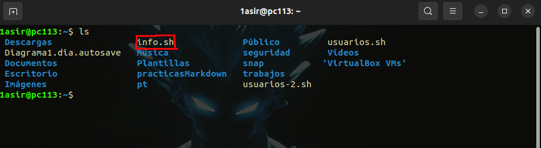

# **Direccionamiento** 


>Este es un repositorio para comprobar como funciona el direccionamiento en Linux (Ubuntu) :computer:


### *Generar un archivo llamado informe.txt con la siguiente información* :
  
  * Fecha(con formato %d-%m-%Y)
  * Espacio en disco(usaremos "df -h")
  * La memoria libre del sistema(usaremos "free -h")
  * Usuarios conectados(usaremos "who")


**NOTA:Usaremos un direccionamiento externo para evitar direccionar por cada línea de comando de nuestro script**


* Primero creamos nuestro archivo sctript llamado "info.sh"

    ```
    nano info.sh
    ```
    
* Vamos a usar el enunciado y sus comandos para elaborar nuestro script
```sh

#!/bin/bash
#para fecha
echo "Fecha: $(date +%d-%m-%Y)"
#espacio en disco
echo "El espacio en disco es:"
df -h
#memoria libre del sistema
echo "La memoria libre del sistema es: "
free -h
#usuarios conectados
echo "Los usuarios conectados son: "
who

```
* Una vez creado el script, comprobamos con el comando ls que se encuentra en nuestro directorio /home/1asir
  
* Ahora vamos a usar el direccionamiento externo para que nos mande la informacion de lo que hace el script a un archivo, el archivo informe.txt. Para ello usaremos el signo matemático > o >> segun queramos machacar el archivo o ir añadiendo información.Ejecutaremos el script con el comando sh + nombreScript y direccionamos, quedaría así:

  ```  sh info.sh >> informe.txt
   ```

